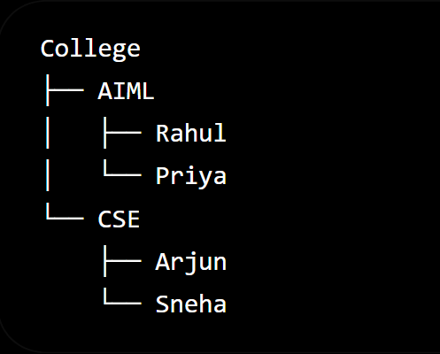

# Day 3 - DBMS Users, Data Models & Database Languages

## DBMS Users

### End User

Interacts with the application to perform tasks like viewing, searching, and updating data.

Example:

- Student
- Customer
- Employee

---

### Database Administrator (DBA)

Responsible for managing the database.

Responsibilities:

- Backup
- Recovery
- Security
- Performance Tuning
- User Management

---

### Application Developer

Develops software that interacts with the database.

Example:

- Library Management System
- Banking Application

---

### Data Analyst

Analyzes data to generate reports and insights.

---

# Data Models

A Data Model is a blueprint used to organize and represent data inside a database.

## Hierarchical Model

- Tree structure
- One parent can have many children but one child cannot have multiple parents.

## Network Model

- A child can have multiple parents

Example:

A student can enroll in multiple clubs.
Club A ---- Rahul ---- Club B

## Relational Model

This is the KING.

- Stores data in tables
- Most widely used model
- Uses SQL
  Ex:
  | ID | Name | Branch |
  | -- | ----- | ------ |
  | 1 | Rahul | AIML |

---

# Database Languages

- Four Types

DDL
↓
DML
↓
DCL
↓
TCL

## DDL (Data Definition Language)

Used to define or modify the database structure.

Commands:

- CREATE
- ALTER
- DROP
- TRUNCATE
- RENAME

---

## DML (Data Manipulation Language)

Used to manipulate data inside tables.

Commands:

- INSERT
- UPDATE
- DELETE

---

## DCL (Data Control Language)

Used to control user permissions.

Commands:

- GRANT
- REVOKE

---

## TCL (Transaction Control Language)

Used to manage transactions.

Commands:

- COMMIT
- ROLLBACK
- SAVEPOINT

---

# Difference Between DDL and DML

| DDL                        | DML          |
| -------------------------- | ------------ |
| Changes database structure | Changes data |
| CREATE TABLE               | INSERT INTO  |

---

# Key Points

- DBA manages the database.
- Relational Model is the most commonly used data model.
- SQL consists of DDL, DML, DCL, and TCL.
- DDL changes structure.
- DML changes data.
- DCL manages permissions.
- TCL manages transactions.
