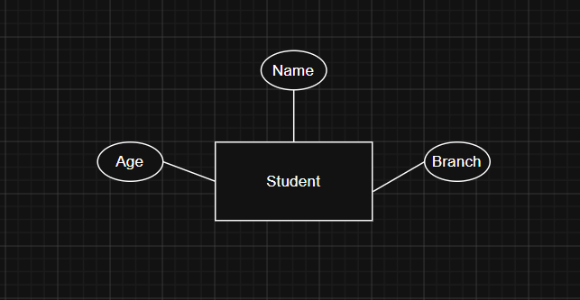

# Day 4 - ER Model (Entities, Attributes & Keys)

## Introduction

Before creating tables or writing SQL queries, we need to identify what things exist in the system.
This is done using the **Entity-Relationship (ER) Model**.

The ER Model helps us design a database by identifying entities, their attributes, and the relationships between them.

Imagine You're Building a Hospital Management System
**"What things exist in this system?"**

Possible answers:

- Patient
- Doctor
- Nurse
- Medicine
  These are the main objects.

In DBMS, we call them "Entity"

---

# Entity

An **Entity** is a real-world object that can be uniquely identified and about which information is stored.

### Examples

- Student
- Book

**Memory Tip:**

> If it is a noun and you want to store information about it, it is probably an Entity.

---

# Attribute

An **Attribute** is a property that describes an Entity.

### Example

Entity: Student

Attributes:

- USN
- Name
- Age
- Branch
- Email

---

# Entity vs Attribute

| Entity   | Attribute |
| -------- | --------- |
| Student  | Name      |
| Book     | Title     |
| Employee | Salary    |

---

# How are Entities and Attributes Drawn?

In an ER Diagram:

Entity is drawn as Rectangle.

Attribute is drawn as Oval.

---

# Types of Attributes

## 1. Simple Attribute

Cannot be divided into smaller parts.

Examples:

- Age
- Salary
- Gender

---

## 2. Composite Attribute

Can be divided into multiple smaller attributes.

Examples:

Address

↓

- House Number
- Street
- City
- State
- PIN Code

Another example:

Name

↓

- First Name
- Middle Name
- Last Name

---

## 3. Single-Valued Attribute

Contains only one value.

Examples:

- USN
- Date of Birth
- Blood Group

---

## 4. Multi-Valued Attribute

Contains multiple values.

Example:

Phone Numbers
A person may have multiple phone numbers.

---

## 5. Derived Attribute

Calculated from another attribute.

Example:

Date of Birth → Age
Age does not have to be stored because it can be calculated. Therefore Age is derived attribute

## Important Concept

One attribute can belong to multiple categories.

Example: Age

It is:

- Simple
- Single-valued
- Derived (if calculated)

---

# Keys

A **Key** is an attribute used to uniquely identify an entity.

---

## Candidate Key

A Candidate Key is any attribute that can uniquely identify a record.

Example:

Student Table

- USN
- Aadhaar Number
- Email

All are unique and any one of them can be a Primary Key.
Therefore, all are Candidate Keys.

---

## Primary Key

A Primary Key is one Candidate Key selected by the database designer to uniquely identify every record.

Example:

Candidate Keys:

- USN
- Aadhaar Number
- Email

Selected Primary Key:

- USN

---

# Difference Between Candidate Key and Primary Key

| Candidate Key                     | Primary Key                                     |
| --------------------------------- | ----------------------------------------------- |
| Multiple Candidate Keys can exist | Only one Primary Key is chosen                  |
| Can uniquely identify a record    | Selected Candidate Key used to identify records |

---

# Important Points

- Every Primary Key is a Candidate Key.
- Not every Candidate Key becomes the Primary Key.
- Primary Key values must be unique.
- Primary Key cannot contain NULL values.

---

# Real-World Example

Library Management System

### Entity

Book

### Attributes

- BookID
- Title
- Author
- Category
- Price

Primary Key:

BookID

---

# Summary

- Entity = Real-world object
- Attribute = Property of an Entity
- Simple Attribute = Cannot be divided
- Composite Attribute = Can be divided
- Single-Valued Attribute = One value
- Multi-Valued Attribute = Multiple values
- Derived Attribute = Calculated from another attribute
- Candidate Key = Any unique attribute
- Primary Key = Selected Candidate Key
